# Vue d'ensemble du workflow documentaire

> Vue dérivée, non-normative. Source de vérité : [`responsibility-matrix.md`](responsibility-matrix.md).
> En cas de divergence, la matrice gagne.

Ce document sert à *voir* le workflow d'un coup d'œil : quelles commands
s'invoquent quand, quels documents elles produisent, et comment tout ça
s'enchaîne. Il montre la logique — il ne l'énonce pas. Chaque règle citée ici
vit ailleurs, à son emplacement normatif ; les renvois pointent vers la source.

Lecture recommandée : §1 pour la chronologie, §2 pour la répartition des
contenus, §3 pour l'outillage, §4 pour retrouver le geste concret d'une
situation donnée.

---

## Sommaire

1. [Le cycle de vie d'un projet](#1--le-cycle-de-vie-dun-projet)
2. [La carte documentaire](#2--la-carte-documentaire)
3. [Le graphe des outils](#3--le-graphe-des-outils)
4. [Le cycle de vie d'un ADR](#4--le-cycle-de-vie-dun-adr)
5. [Chemins de lecture](#5--chemins-de-lecture)
6. [Renvois](#6--renvois)
7. [Incohérences relevées](#7--incohérences-relevées)

---

## 1 — Le cycle de vie d'un projet

Quatre phases enchaînées **Phase 0 → Phase 1 → Phase 2**. Les deux premières se
traversent une fois ; la Phase 2 boucle sur elle-même à chaque session. La
**Phase 3** s'insère quand la réalité diverge du plan, puis rend la main à la
Phase 2.

### Phase 0 — Définition (one-shot)

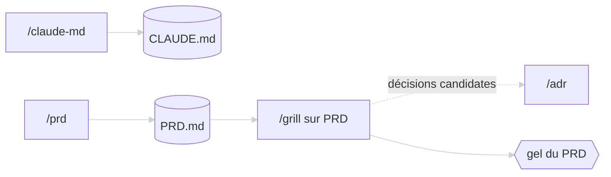

CLAUDE.md et PRD.md sont indépendants en contenu : **l'ordre entre les deux est
libre**. Seul le PRD passe la revue adverse avant gel — `/grill` ne *produit*
rien, il signale des décisions candidates que l'humain résout en open question du
PRD ou formalise via `/adr`, sans jamais invoquer la command lui-même
([`adr/0003`](../../adr/0003-grill-delegue-adr-sans-invoquer.md)).

### Phase 1 — Planning (one-shot)

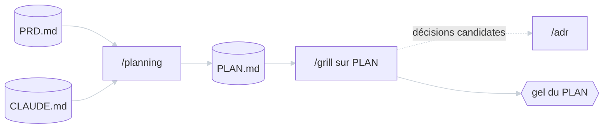

`/planning` **dérive** le PLAN du PRD et de CLAUDE.md — il ne ré-idée ni le
*quoi* ni le *pourquoi*, déjà figés. Seconde invocation de `/grill`, sur le PLAN
cette fois : **un artefact par invocation**, jamais les deux à la fois.

### Phase 2 — Implémentation (boucle par session)

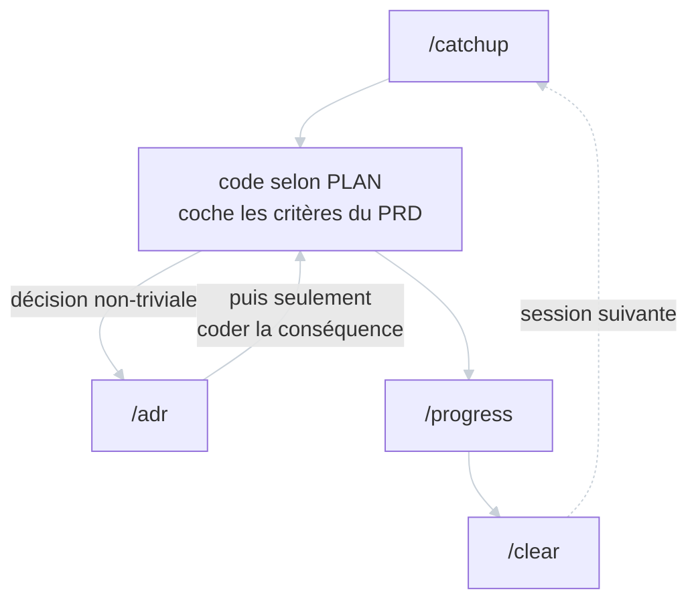

Le cycle nominal d'une session : `/catchup` au démarrage, `/progress` avant
`/clear`. En cours de route, une décision non-triviale s'écrit **avant** d'en
coder la conséquence — l'ADR précède le code qu'il justifie, jamais l'inverse.

### Phase 3 — Replanification (sur drift ou inflexion)

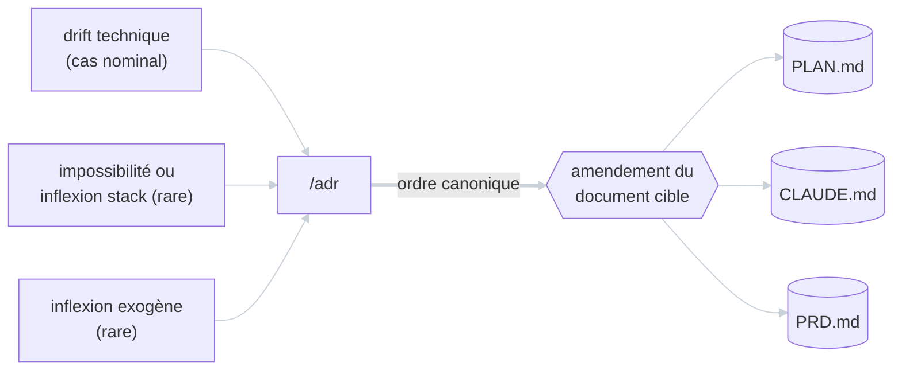

Trois déclencheurs, trois cibles, **un seul ordre** : l'ADR documente le pourquoi,
*puis* le document cible est amendé. Jamais l'inverse — amender sans ADR
justificatif perd la traçabilité. Chaque déclencheur a sa cible propre : drift
technique → PLAN, inflexion stack → CLAUDE.md, inflexion exogène → PRD.

`/grill` **n'intervient jamais ici** : re-litiger un artefact gelé est hors de son
scope. Un drift se traite par l'ordre canonique ci-dessus, pas par un re-grill.

> **Track léger** — un projet mono-utilisateur, sans collaborateurs ni
> distribution publique, saute les Phases 1 et 3 : il vit sur CLAUDE.md +
> progress.md, sans PLAN ni ADR. Critère et conséquences :
> [`adr/0011`](../../adr/0011-track-leger-petits-projets.md). Le parcours
> correspondant est en [§5](#5--chemins-de-lecture).

## 2 — La carte documentaire

Cinq documents, cinq contenus disjoints. Le tableau donne la clé de tri ; le
diagramme montre qui écrit dans qui.

| Document | Rythme | Détient | Écrit par |
|---|---|---|---|
| **CLAUDE.md** | Stable | Conventions, stack, contraintes transverses | `/claude-md`, puis Phase 3 |
| **PRD.md** | Baseline versionnée | Le *quoi* et le *pourquoi* : problème, goals, critères d'acceptation | `/prd`, puis Phase 3 |
| **PLAN.md** | Semi-frozen | Le *comment* et l'*ordre* : architecture cible, paliers MVP, phases | `/planning`, puis Phase 3 |
| **adr/NNNN-\*.md** | Corps immuable, statut mutable | Une décision par fichier, avec son rationale | `/adr` |
| **progress.md** | Vivant, court | État de session, prochaine action, blockers | `/progress` |

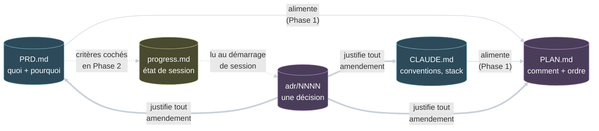

**Les trois régimes d'écriture** (les trois styles de flèche) :

- **Flèche pleine — dérivation.** PLAN est *dérivé* de PRD + CLAUDE.md en Phase 1.
  Dérivé, pas dupliqué : la stack reste dans CLAUDE.md, le PLAN y renvoie.
- **Double flèche — amendement sous ADR.** Les trois documents durables ne se
  modifient qu'après un ADR qui acte le pourquoi. C'est la seule porte d'entrée
  vers PRD, PLAN et CLAUDE.md une fois gelés.
- **Flèche pointillée — lecture / cochage.** progress.md ne décide rien ; il note
  où on en est. Les critères d'acceptation vivent dans le PRD et s'y cochent.

**Ce qu'aucune flèche ne relie**, et c'est délibéré :

- **progress.md n'écrit dans aucun document durable.** Une décision qui apparaît
  en session va en ADR, pas dans progress.md ; un changement de plan passe par
  ADR puis PLAN. Le test : *ce contenu sera-t-il pertinent dans 6 mois ?*
- **PRD et CLAUDE.md ne se parlent pas.** Le PRD doit rester lisible par
  quelqu'un qui ignore la stack ; la stack n'apparaît jamais dans le PRD.
- **PLAN n'écrit pas dans PRD.** Découper la cible ne la change pas. Si le
  découpage révèle que la cible elle-même doit bouger, c'est un ADR + un
  amendement du PRD ([`adr/0002`](../../adr/0002-mvp-palier-dans-plan.md)).

> Les règles de non-overlap, les tests décisifs et les frontières floues sont
> énoncés dans la matrice — ce tableau n'en est qu'une vue.

## 3 — Le graphe des outils

Sept commands. §2 répondait à « qui touche ce document ? » ; ici c'est l'inverse —
« que touche cette command ? ».

### Outils projet (Phases 0-1)

Ceux qui construisent les artefacts durables. Invoqués une fois chacun, sauf
`/grill` (deux fois : PRD puis PLAN) et `/adr` (à la demande).

| Command | Lit | Produit |
|---|---|---|
| `/claude-md` | `.cruft.json`, arborescence, PRD.md | **CLAUDE.md** |
| `/prd` | `.cruft.json` | **PRD.md** |
| `/planning` | PRD.md, CLAUDE.md | **PLAN.md** |
| `/grill` | PRD.md **ou** PLAN.md | *rien* — une liste de décisions candidates |
| `/adr` | ADRs existants, le fil de conversation | **adr/NNNN-\*.md** |

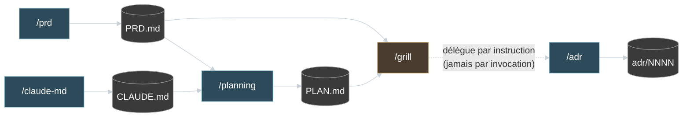

### Outils de session (Phase 2)

Ceux qui ouvrent et ferment une session de travail. Invoqués à chaque cycle.

| Command | Lit | Produit |
|---|---|---|
| `/catchup` | progress.md, PRD.md, CLAUDE.md, état git | *rien* — un résumé en session |
| `/progress` | progress.md, PRD.md, état git | **progress.md** |


`/adr` traverse les deux familles : invoqué en Phase 0-1 sur les décisions
révélées par `/grill`, et en Phase 2 dès qu'une décision non-triviale surgit.

**Producteurs et lecteurs**, visibles à la couleur dans les deux diagrammes :

- **Les producteurs** (bleu) — `/claude-md`, `/prd`, `/planning`, `/adr`,
  `/progress` écrivent un fichier. Chacun en écrit **un seul**, toujours le même.
- **Les lecteurs** (orange) — `/grill` et `/catchup` n'écrivent jamais. Leur
  sortie est une analyse en session : une liste de décisions candidates pour l'un,
  un résumé d'état pour l'autre.

**La délégation par instruction** (flèche pointillée `/grill` → `/adr`) est la
relation la plus subtile : `/grill` *dit* à l'humain qu'un ADR serait
justifié, mais ne lance pas la command — l'humain décide et invoque
([`adr/0003`](../../adr/0003-grill-delegue-adr-sans-invoquer.md)). Aucune command
n'en invoque une autre ; toutes les transitions passent par l'humain.

**Trois gardes-fous** portés par les commands elles-mêmes, pas par la discipline :

- `/prd` et `/planning` **refusent d'écraser** un fichier existant. Le message
  d'erreur renvoie vers le bon geste : `/progress` pour noter un écart, ou
  ADR + amendement pour une révision réelle.
- `/grill` traite **un seul artefact par invocation**, le type étant déduit du
  fichier résolu.
- `/adr` a deux modes — *interview* (la décision vient de l'humain et n'est pas
  mûre) et *capture* (`--from-context`, la décision a déjà été délibérée dans le
  fil). Le mode pilote l'interaction seulement : il ne laisse aucune trace dans
  l'ADR produit.

> La couche learning (`teach`, `code-mentor`, `coach-pedagogique`, `dp-coach`,
> `feynman-mentor`) est hors de ce graphe : cinq outils d'apprentissage, sans
> recouvrement avec les commands documentaires. Voir la section dédiée de la
> [matrice](responsibility-matrix.md#couche-learning-non-overlap-des-outils-dapprentissage).

## 4 — Le cycle de vie d'un ADR

L'ADR est le seul des cinq documents à avoir une véritable machine à états. Deux
zones aux règles opposées : le **corps** (contexte, options, décision,
conséquences) est figé à l'acceptation ; seul le champ `Status` transitionne
ensuite.

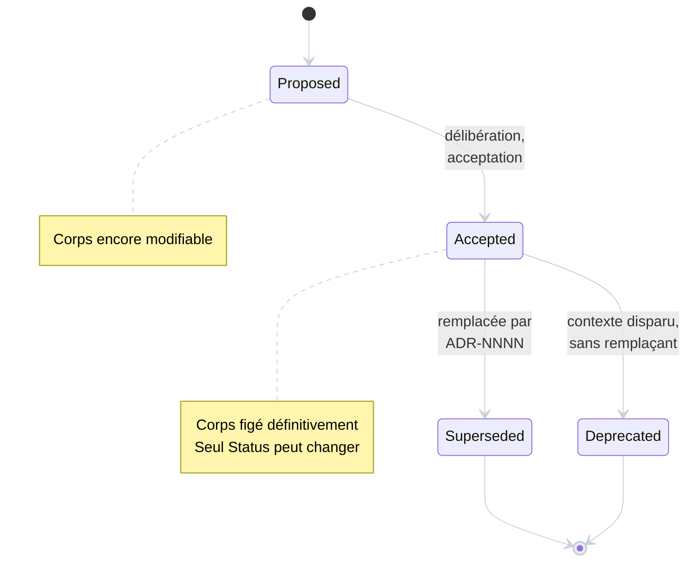

**Ce que la machine à états implique :**

- **Un typo, une compréhension qui évolue, un détail manquant** ne se corrigent
  pas dans le corps : ils donnent lieu à un **nouvel** ADR. Amender détruirait la
  traçabilité ; superséder la renforce.
- **`Deprecated` n'est pas `Superseded`.** Deprecated = plus applicable, *sans
  remplaçant* (le composant concerné a disparu). Superseded = une décision plus
  récente a pris le relais, et le nouvel ADR la nomme.
- **Les états terminaux restent lisibles.** Un ADR superséded n'est ni déplacé ni
  supprimé : il reste dans `adr/`, son corps intact, et son en-tête pointe vers
  la décision courante.

**Les cinq relations entre ADRs** — vocabulaire à employer tel quel :

| Relation | Effet sur l'ADR ancien | Cas typique |
|---|---|---|
| **Supersedes** | Statut → `Superseded by` | Revirement, changement de stack |
| **Refines** | Reste `Accepted` | Précision ajoutée, sans contradiction |
| **Extends** | Reste `Accepted` | Nouveau cas couvert |
| **Constrains** | Reste `Accepted` | Champ d'application rétréci |
| **Conflicts with** | Reste `Accepted` | **À éviter** — dette à résoudre en supersession |

Seule **Supersedes** modifie l'ancien ADR, et l'opération est **bidirectionnelle** :
le nouvel ADR déclare `Supersedes: ADR-NNNN` dans son corps, l'ancien voit son
`Status` passer à `Superseded by ADR-NNNN`. Deux fichiers touchés, un seul corps
écrit.

> Cycle de vie complet, règles de numérotation, template et rationale :
> [`conventions/adr.md`](conventions/adr.md).

## 5 — Chemins de lecture

Quatre situations vécues, quatre parcours. Les sections précédentes rangent par
structure ; celle-ci range par besoin — *« je suis là, je fais quoi ? »*.

### « Je démarre un projet »

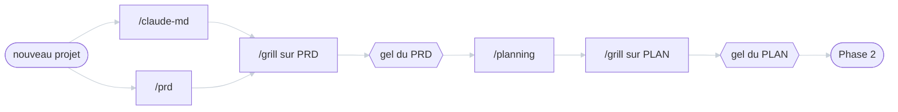

`/claude-md` et `/prd` dans l'ordre qui t'arrange. Chaque `/grill` produit des
décisions candidates : les mûres partent en `/adr`, les autres restent en open
questions du PRD. Détail en [§1](#1--le-cycle-de-vie-dun-projet).

### « Je reprends une session »

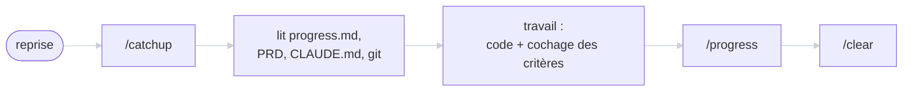

`/catchup` reconstruit le contexte, `/progress` le sauvegarde avant de le vider.
Le cycle est fermé : ce que `/progress` écrit est exactement ce que `/catchup`
relira. Ne rien écrire avant `/clear`, c'est perdre la session.

### « Un drift apparaît en Phase 2 »

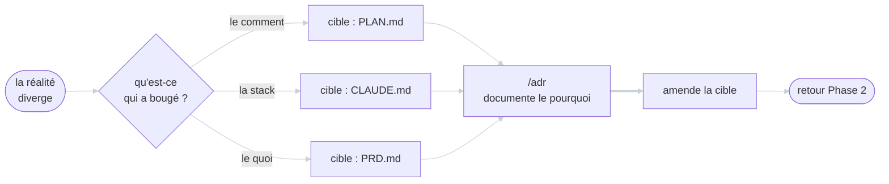

Qualifier d'abord, écrire l'ADR ensuite, amender en dernier. Le réflexe à éviter :
corriger le PLAN directement parce que « c'est évident » — l'évidence
d'aujourd'hui est l'énigme de dans six mois. Pas de `/grill` ici : l'artefact est
gelé, on ne le re-litige pas.

### « Petit projet perso » (track léger)

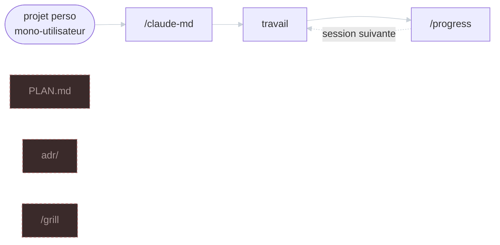

**Ce diagramme décrit surtout ce qu'on ne fait *pas*.** Les trois boîtes
détachées en pointillé — PLAN.md, `adr/`, `/grill` — sont les artefacts et outils
**volontairement omis**, pas des étapes à venir. Le projet vit sur
**CLAUDE.md + progress.md**.

Le PRD, lui, n'est pas exclu : il est **optionnel**, et sa rédaction s'allège.
`/prd` reste disponible mais son interview complète est souvent disproportionnée
à ce niveau d'enjeu — quelques lignes de cadrage écrites à la main font l'affaire.
S'il existe déjà, il peut rester gelé tel quel comme artefact historique, sans
être conformé à la doctrine PRD-allégé.

Les décisions durables se consignent dans la section « Décisions prises » de
progress.md, **pas en ADR** — c'est la contrepartie assumée de l'exemption.

Critère d'éligibilité : mono-utilisateur, sans collaborateurs, sans distribution
publique, durée de vie non-critique. Les quatre à la fois. Le classement est
**réversible** : si une seule condition tombe, le projet bascule vers le workflow
complet — et cette bascule est elle-même une décision non-triviale, donc un ADR
([`adr/0011`](../../adr/0011-track-leger-petits-projets.md)).

## 6 — Renvois

### Documents de méthodologie

| Document | Rôle |
|---|---|
| [`responsibility-matrix.md`](responsibility-matrix.md) | **Source de vérité.** Matrice principale, règles de non-overlap, cycles d'écriture, frontières floues |
| [`conventions/adr.md`](conventions/adr.md) | Satellite ADR : cycle de vie détaillé, numérotation, template, rationale |
| [`karpathy-discipline.md`](karpathy-discipline.md) | Discipline de code (clarifier → simplifier → cibler → vérifier). Même statut non-normatif que ce document |

### Index des ADRs

Les douze ADRs du repo, tous en statut `Accepted` à ce jour.

| # | Titre | Relations |
|---|---|---|
| [0001](../../adr/0001-prd-produit-cible.md) | Le PRD décrit le produit cible, frozen comme baseline révisable | — |
| [0002](../../adr/0002-mvp-palier-dans-plan.md) | MVP = palier de valeur nommé dans le PLAN | Extends 0001 |
| [0003](../../adr/0003-grill-delegue-adr-sans-invoquer.md) | `/grill` délègue à `/adr` par instruction, sans l'invoquer | — |
| [0004](../../adr/0004-reference-markdown-lessons-html.md) | `reference/` en Markdown, `lessons/` en HTML dans le workspace `teach` | — |
| [0005](../../adr/0005-retention-unifiee-anki.md) | Rétention unifiée via Anki | — |
| [0006](../../adr/0006-pont-etat-learning-records.md) | Pont d'état — convergence vers le `learning-records` unique | — |
| [0007](../../adr/0007-teach-emplacement-frontieres.md) | Adoption de `teach` — emplacement, frontières inter-outils | — |
| [0008](../../adr/0008-mecanique-pont-record-propose.md) | Mécanique du pont d'état — record proposé, jamais écrit par l'outil | Refines 0006 |
| [0009](../../adr/0009-rituel-evals-maison-vs-skill-creator.md) | Rituel d'evals maison (A→B→A) vs Skill Creator officiel | — |
| [0010](../../adr/0010-surcharge-code-review-user-scope.md) | Surcharge user-scope de `/code-review` | — |
| [0011](../../adr/0011-track-leger-petits-projets.md) | Track léger documentaire pour les petits projets personnels | — |
| [0012](../../adr/0012-feynman-mentor-niche-verification-par-explication.md) | `feynman-mentor` — 5ᵉ niche de la couche learning | Extends 0007 |

Structurants pour ce document : **0001** (nature du PRD), **0002** (MVP dans le
PLAN), **0003** (délégation `/grill` → `/adr`), **0011** (track léger). Les ADRs
**0004-0008** et **0012** concernent la couche learning, **0009** et **0010** l'outillage.

Pour obtenir la vue courante des décisions actives, sans index à maintenir :

```bash
grep -L "Superseded\|Deprecated" adr/*.md
```

### Couche learning

Hors périmètre de ce document. Cinq outils — `teach`, `code-mentor`,
`coach-pedagogique`, `dp-coach`, `feynman-mentor` — sans recouvrement entre eux
ni avec les commands documentaires :
[section dédiée de la matrice](responsibility-matrix.md#couche-learning-non-overlap-des-outils-dapprentissage).

## 7 — Incohérences relevées

Points de friction observés en construisant cette vue, signalés sans correction
à la livraison (2026-07-28). Le statut de chaque point est tenu à jour ici ; le
traitement lui-même vit dans la matrice, les commands ou un ADR — jamais dans ce
document.

### 7.1 — « Décisions prises » dans progress.md vs la règle progress/ADR

> **Résolu (2026-07-28)** — la lecture *journal de bord* est actée et formulée
> dans la matrice (bloc « progress vs ADR ») et le prompt de `/progress` : une
> décision durable vit dans son ADR, la section n'en porte que le pointeur
> (« décision → `adr/NNNN` ») ; les choix de portée session s'y notent
> directement ; le track léger (ADR-0011) garde son exemption.

Le point relevé : la matrice interdisait les décisions dans progress.md, mais
`/progress` produisait une section « Décisions prises » listant « les choix
faits pendant cette session », sans trancher entre *journal de bord* (trace,
l'ADR restant la source) et *destination de décision* (conflit direct avec la
règle).

### 7.2 — Le PRD comme lieu de cochage vs baseline non-dérivante

> **Résolu (2026-07-28)** — la distinction état/cible est formulée dans la
> matrice (bloc « PRD : cocher un critère vs réviser la baseline ») : cocher un
> acceptance criterion enregistre un **état**, la **cible** reste intacte —
> aucun ADR ; seule l'édition du *contenu* (modifier, ajouter, supprimer un
> critère) révise la baseline et suit l'ordre canonique de Phase 3.

Le point relevé : la matrice décrivait le PRD comme une baseline qui « ne dérive
pas par édition silencieuse » tout en prescrivant, en Phase 2, de « cocher les
acceptance criteria » — sans que la distinction entre « éditer le PRD » et
« cocher dans le PRD » soit écrite nulle part.

### 7.3 — `/claude-md` lit le PRD, sans ordre imposé en Phase 0 *(prioritaire)*

> Contrairement à 7.1 et 7.2 — des intentions claires mais non formulées — ce
> point est un **écart factuel** : la matrice affirme quelque chose que la
> command contredit. À instruire en inspectant conjointement ce repo et le
> template Cruft.

La matrice pose que CLAUDE.md et PRD.md sont « indépendants en contenu et peuvent
être menés dans n'importe quel ordre ». Le pré-flight de `/claude-md` lit pourtant
`PRD.md` s'il existe, pour en extraire « stack technique, architecture, phases
d'implémentation ».

Deux conséquences non documentées :

- **Sur une instance Cruft, l'ordre est imposé, pas libre.** `/claude-md`
  applique une gate bloquante : `.cruft.json` présent + `PRD.md` absent →
  poursuite interdite. Le PRD doit donc précéder CLAUDE.md dans ce cas de figure,
  ce que la formulation « n'importe quel ordre » de la matrice ne laisse pas
  prévoir. Hors instance Cruft, l'ordre reste effectivement libre.
- **Les champs lus n'existent plus dans le PRD.** Le pré-flight cherche « stack
  technique, architecture, phases d'implémentation » — précisément ce que la
  matrice **exclut** du PRD, et qui ne figure pas dans les 8 sections du PRD
  allégé. Ce pré-flight semble dater d'un format de PRD antérieur à la doctrine
  actuelle.
