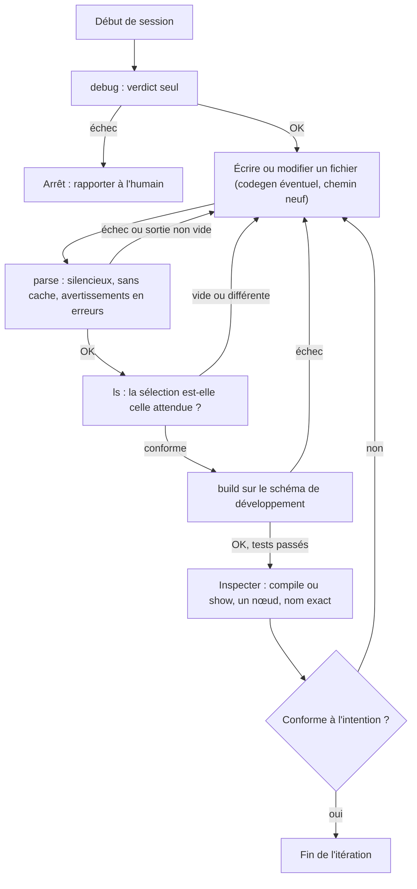

# Confier les commandes dbt à un agent — préconisations et workflow (v2, premier jet à éprouver)

> **Statut** : hypothèse de travail, à éprouver sur Snowflake. Non intégré au corpus. Remplace la version précédente (qui ne couvrait que `show`, `run-operation` et `codegen`).
>
> **Origine des preuves** : banc DuckDB (dbt-core 1.12.5, dbt-duckdb 1.11.0, `codegen` branche `main` au 2026-09-25). **Aucun agent réel n'a été observé** avec ces outils. **Rien n'a été testé sur Snowflake**.
>
> **Étiquettes**
>
> | Étiquette | Signification |
> |---|---|
> | **[Doctrine]** | dbt Labs l'énonce explicitement |
> | **[Observé]** | constaté sur le banc, non documenté ou en écart avec la doc |
> | **[Déduction]** | conclusion tirée des constats, non énoncée par dbt Labs |
> | **[Non testé]** | jamais exécuté ici |
>
> **Applicabilité à Snowflake** (ajout) : chaque principe et chaque règle est aussi classé selon sa transposabilité, dans la section III.F.
>
> | Étiquette | Signification |
> |---|---|
> | **[Cœur dbt]** | logique de dbt-core, indépendante de l'entrepôt : devrait se transposer |
> | **[Adaptateur]** | dépend de l'adaptateur ou du dialecte SQL : à revalider sur Snowflake |
> | **[Snowflake]** | propre à Snowflake, d'après la doc ou le code de `dbt-snowflake` 1.12.1 (lu, non exécuté) |
>
> Ce classement est **ma lecture** de la doc et du code, pas un test.
>
> **Renvois** : les fiches `dbt_debug.md`, `dbt_parse.md`, `dbt_ls.md`, `dbt_compile.md`, `dbt_show.md`, `dbt_run_operation.md` contiennent les preuves détaillées. Ce document en tire des **règles** et les **justifie**.

## Comment lire ce document

| Partie | Pour qui | Charger dans l'agent ? |
|---|---|---|
| **I. Principes** | L'humain : comprendre le raisonnement | Non |
| **II. Blocs à injecter** | L'agent : règles courtes, par commande | **Oui**, seulement les blocs utiles à l'étape en cours |
| **III. Annexe justificative** | L'humain : preuves, matrice de détection, protocole Snowflake | Non |
| **IV. Synthèse du workflow** | L'humain et l'agent : vue d'ensemble | Le schéma peut être injecté |

**Pourquoi cette séparation** : un long document chargé dans le contexte de l'agent coûte des tokens à chaque échange et dilue les règles importantes. Les blocs de la partie II sont volontairement courts ; chaque règle y porte un identifiant (`[P1]`, `[L2]`…) qui renvoie à sa justification dans la partie III.

---

# PARTIE I — Les cinq principes

## Principe 1 — Trois paliers de risque : commencer toujours par le plus bas

Toutes les commandes ne se valent pas : certaines ne touchent jamais à la base, d'autres peuvent la modifier.

| Palier | Commandes | Ce que les tests ont montré |
|---|---|---|
| **A. Hors ligne, sans effet de bord** | `parse`, `ls` | Avec une base **injoignable**, ils réussissent (code 0). Un modèle qui contient `run_query` n'exécute **rien** avec eux. **[Observé]** |
| **B. Connexion, effet de bord possible ou coût** | `compile`, `debug`, macros `codegen` | `compile` a **créé et persisté** une table via `run_query`. `debug` exécute une requête (`select 1 as id`). `codegen` interroge les métadonnées de l'entrepôt. **[Observé]** |
| **C. Exécution** | `show`, `build`, `test`, `run-operation` | `show --inline "create table ..."` a **créé et persisté** une table. **[Observé]** |

**Règle qui en découle** : l'agent ne passe au palier B ou C qu'après avoir réussi le palier A. **Pourquoi** : un contrôle de palier A est gratuit et sans risque ; il attrape une partie des erreurs avant de solliciter l'entrepôt. **[Déduction]**

**Nuance** : la doc classe `show` en « lecture » et `run-operation` en « écriture ». Cette classification **n'est pas une garantie de sécurité** : `show --inline` a écrit dans la base. **[Doctrine]** (classification) contre **[Observé]** (effet réel).

## Principe 2 — « Code de sortie 0 » ne prouve pas le succès

Un agent lit d'abord le code de sortie. Or plusieurs commandes sortent en code 0 sans avoir produit ce qu'on attend :

| Commande | Situation | Ce que l'agent voit | Ce qui s'est passé |
|---|---|---|---|
| `ls` | Sélection vide, ou joker sur un nom nu (`fct_*`) | Code 0, **sortie vide** (`--quiet`) | Aucun nœud sélectionné |
| `show` | `tag:x`, sélection multiple | Code 0, aucun aperçu ou aperçu d'**un seul** nœud | Sélection non supportée par la commande |
| `show` | Modèle incremental existant | Code 0, **0 ligne** | La branche incrementale filtre tout |
| `compile` | `tag:x` ou sélection multiple | Code 0, aucun SQL affiché (ou un seul bloc) | Compilé, mais non affiché |
| `parse --warn-error` | Deuxième appel sur projet inchangé | Code 0 | Le cache masque l'avertissement |
| `generate_model_yaml` | Modèle non construit | Code 0, YAML | `columns:` **vide** |
| `codegen` sans `--quiet`, redirigé | Fichier écrit | Fichier créé | YAML **invalide** (`dbt parse` échoue) |
| `run-operation --sql` (DuckDB) | Opération d'écriture | `OK executed inline_query` | Table **non persistée** |
| `debug --quiet` | Base injoignable | Code 1, **0 octet** de sortie | Cause invisible |
| `show --inline` | `create table ...` | Aperçu, code 0 | Table **créée** |

Toutes ces lignes sont **[Observé]** (détail dans les fiches).

**Règle qui en découle** : le succès se juge sur le **code de sortie ET le contenu de la sortie**, avec une condition propre à chaque commande (partie III, §D). **Pourquoi** : sinon l'agent conclura « tout va bien » sur une base fausse.

## Principe 3 — Préférer le garde-fou technique à la consigne

Une consigne écrite est appliquée de façon imparfaite par un agent. Une contrainte imposée par l'outillage l'est toujours. Chaque règle est donc classée :

- **Garde-fou** : imposé par un script enveloppe, un rôle Snowflake, ou les permissions de l'outil de l'agent.
- **Consigne** : écrite dans le prompt, seul filet quand l'outillage ne peut pas la faire respecter.

**Pourquoi** : les échecs du principe 2 sont **silencieux**. On ne peut pas demander à l'agent de repérer ce qui ne se voit pas ; il faut que le script enveloppe vérifie la sortie à sa place. **[Déduction]**

## Principe 4 — Un budget de tokens explicite

**[Observé]** (estimations par deux heuristiques : caractères / 4 et découpage par expression régulière ; pas de tokenizer Claude) :

| Sortie | Tokens estimés | Règle |
|---|---|---|
| `manifest.json` (12 nœuds, 539 macros) | ~178 000 | **Ne jamais le lire en entier** ; extraire par script (~280 tokens pour les modèles) |
| `dbt ls --output json`, toutes clés (12 nœuds) | 2 900 à 4 000 | Toujours `--output-keys` (240 à 310 tokens pour 3 clés) |
| `dbt debug` | 370 à 490 | Ne renvoyer à l'agent que les lignes de verdict |
| YAML `codegen` (50 colonnes) | 600 à 1 000 | Rediriger vers un fichier, ne pas l'afficher |

**Pourquoi** : la lecture est moins chère que l'écriture, mais elle reste dans le contexte pour tous les échanges suivants.

## Principe 5 — Seul `build` valide une matérialisation

**[Observé]** Un nom de matérialisation invalide (`materialized='nonsense'`) passe `parse` (code 0) et `compile` (code 0). Seul `dbt run` échoue (code 1).

**Règle qui en découle** : un choix de matérialisation par l'agent n'est **validé que par un `dbt build`** sur un schéma de développement. **Pourquoi** : c'est précisément le choix que l'agent doit faire dans sa tâche, et aucun contrôle hors exécution ne le vérifie. **[Déduction]** Sur Snowflake, les matérialisations propres à l'adaptateur (par exemple les tables dynamiques) restent à éprouver. **[Non testé]**

---

# PARTIE II — Blocs à injecter dans l'agent

**Mode d'emploi** : injecter le **socle** en permanence, puis les **sections** correspondant aux commandes que l'agent va utiliser à l'étape en cours. Les commentaires `<!-- DÉBUT ... -->` / `<!-- FIN ... -->` délimitent chaque bloc pour l'extraction. L'identifiant `[X#]` renvoie à la justification (partie III, §C).

**Taille des blocs** (estimations par deux heuristiques : caractères / 4 et découpage par expression régulière ; pas de tokenizer Claude) :

| Bloc | Tokens estimés |
|---|---|
| Socle | 160 à 180 |
| `debug` | 75 à 110 |
| `parse` | 90 à 110 |
| `ls` | 130 à 170 |
| `compile` | 145 à 185 |
| `show` | 200 à 260 |
| `run-operation` | 90 à 100 |
| `codegen` | 165 à 195 |
| **Tout injecter** (socle + 7 sections) | **~1 060 à 1 310** |
| Ce document en entier | ~10 400 à 12 300 |

Injecter seulement le socle et les sections de l'étape en cours (par exemple socle + `parse` + `ls` : environ 380 à 460 tokens) représente moins de 5 % du document.

<!-- DÉBUT SOCLE -->

## Règles communes aux commandes dbt

- **[S1] Palier.** Commence par `parse` et `ls` (hors ligne, sans effet). Passe à `compile`, `show`, `build` seulement si ils réussissent.
- **[S2] Succès = code 0 ET sortie conforme.** Le code 0 seul ne suffit pas : vérifie le contenu attendu (voir chaque section).
- **[S3] Schéma de développement uniquement.** Jamais de production.
- **[S4] Sorties minimales.** N'affiche jamais `manifest.json` en entier, ni du JSON complet de `ls`, ni le bloc `Connection` de `debug`.
- **[S5] Matérialisation.** Seul `dbt build` valide un choix de matérialisation. `parse` et `compile` ne le détectent pas.

<!-- FIN SOCLE -->

<!-- DÉBUT SECTION debug -->

### `dbt debug` (une fois par session)

- **[D1]** Lance `dbt debug` **sans** `--quiet` (sinon un échec ne dit rien).
- **[D2]** Ne retiens que les lignes `[OK ...]`, `[ERROR ...]`, `All checks passed!` et le code de sortie.
- **[D3]** Si le code n'est pas 0, arrête et rapporte. Ne continue pas.

<!-- FIN SECTION debug -->

<!-- DÉBUT SECTION parse -->

### `dbt parse` (après chaque fichier écrit)

- **[P1]** `dbt --quiet parse --no-partial-parse --warn-error`
- **[P2]** Succès = code 0 **et** sortie vide. Sinon lis le message et corrige.
- **[P3]** `parse` ne détecte pas : macro inexistante, cycle, SQL invalide, colonne absente, matérialisation invalide. Ne conclus jamais « projet valide » à partir de `parse` seul.

<!-- FIN SECTION parse -->

<!-- DÉBUT SECTION ls -->

### `dbt ls` (avant toute commande à sélection)

- **[L1]** `dbt --quiet ls --select "<sélection>" --resource-type model --output json --output-keys "name config.materialized" --warn-error`
- **[L2]** Compare la liste obtenue à la liste **attendue**. Vide ou différente = échec.
- **[L3]** Jokers : qualifie (`package.dossier.nom*`). `fct_*` seul renvoie une liste vide.
- **[L4]** Un filtre de matérialisation peut renvoyer des tests : garde `--resource-type model`.
- **[L5]** `ls` détecte les cycles, pas les macros inexistantes.

<!-- FIN SECTION ls -->

<!-- DÉBUT SECTION compile -->

### `dbt compile` (voir le SQL d'un nœud)

- **[K1]** `dbt --quiet compile --select <nom_exact> --no-introspect --output json`
- **[K2]** Succès = clé `compiled` présente et non vide.
- **[K3]** Si l'erreur `Connection already closed` apparaît sur un modèle qui utilise `run_query` ou une macro d'introspection : **n'enlève pas** `--no-introspect` sans accord (risque d'effet de bord).
- **[K4]** Modèle incremental : le SQL dépend de l'état de la table. Précise `--full-refresh` ou non.
- **[K5]** Nom exact seulement : `tag:` ou une liste n'affichent rien, ou un seul nœud.

<!-- FIN SECTION compile -->

<!-- DÉBUT SECTION show -->

### `dbt show` (inspecter un résultat, schéma de dev)

- **[H1]** `dbt --quiet show --select <nom_exact> --limit <N> --output json`
- **[H2]** Succès = clé `show` présente. Aperçu vide : ne conclus pas que le modèle est vide (voir H3).
- **[H3]** Modèle `incremental` déjà construit : 0 ligne est **attendu** (filtre incremental). Vérifie la matérialisation via `ls`.
- **[H4]** Un seul nœud, par son nom exact validé par `ls`. Jamais `tag:`, `+`, liste.
- **[H5]** Les modèles amont doivent être construits, sinon échec ou aperçu faux.
- **[H6]** SQL finissant par `limit` : ajoute `--limit -1`. Retire tout `;` final.
- **[H7]** `--inline` : `SELECT` uniquement, avec `--profile <profil_lecture_seule>`.
- **[H8]** `show` ne prouve ni le grain ni l'unicité : seuls les tests dbt le font.

<!-- FIN SECTION show -->

<!-- DÉBUT SECTION run-operation -->

### `dbt run-operation`

- **[O1]** Autorisé : uniquement `generate_source`, `generate_base_model`, `generate_model_yaml`, `generate_model_import_ctes`, `generate_unit_test_template` (macros `codegen`).
- **[O2]** Interdit : `--sql` et toute autre macro. Si un besoin l'exige, demande à l'humain.
- **[O3]** Code 0 ≠ effet obtenu : vérifie l'effet par une requête.

<!-- FIN SECTION run-operation -->

<!-- DÉBUT SECTION codegen -->

### `codegen` (squelettes de code)

- **[G1]** Macros autorisées : `generate_source`, `generate_base_model`, `generate_model_yaml`, `generate_model_import_ctes`, `generate_unit_test_template`.
- **[G2]** `dbt --quiet run-operation <macro> --args '{...}' > <chemin_nouveau>` : `--quiet` **avant** `run-operation`.
- **[G3]** Ne jamais écraser un fichier existant.
- **[G4]** `generate_model_yaml` : construis d'abord le modèle (`dbt build --select <modèle>`).
- **[G5]** Après génération : `dbt parse` doit passer et le fichier doit contenir des colonnes.
- **[G6]** N'affiche pas le fichier. Relis-le seulement pour le compléter (descriptions, renommages, casts).

<!-- FIN SECTION codegen -->

---

# PARTIE III — Annexe justificative

## A. Ce que chaque commande détecte : la matrice

C'est la base des principes 2 et 5. Symboles : **✔** détecté ; **✘** non détecté ; **⚠** avertissement seulement ; **·** non testé.

| Erreur introduite | `parse` | `ls` | `compile` | `show` | `run` / `build` |
|---|---|---|---|---|---|
| YAML invalide | ✔ (code 2) | · | · | · | · |
| `ref()` ou `source()` inconnu | ✔ (code 2) | · | ✔ (code 2) | · | · |
| Nom de modèle dupliqué | ✔ (code 2) | · | · | · | · |
| **Référence circulaire** | ✘ | ✔ (code 2) | ✔ (code 2) | · | · |
| **Macro inexistante** dans un modèle | ✘ | ✘ | ✔ (code 2) | · | · |
| **SQL invalide** | ✘ | · | ✘ | ✔ (code 2, `--inline`) | · |
| **Colonne inexistante** dans le SQL | ✘ | · | ✘ | · | · |
| **Matérialisation invalide** | ✘ | · | ✘ | · | ✔ (`run`, code 1) |
| Test YAML sur colonne absente du modèle | ✘ | · | · | · | · |
| Patch YAML orphelin ; test avec `ref` inconnu | ⚠ | · | · | · | · |

**Lecture** :
- **La doc dit** que chaque invocation commence par parser le projet **[Doctrine]** ; les cases `·` de la ligne « YAML invalide » sont donc *attendues* ✔, mais non vérifiées commande par commande.
- **Un agent ne peut pas** déduire la validité d'un projet à partir d'un seul contrôle : chaque commande couvre une part différente.
- **Seule l'exécution** (`build`, ou `show`) attrape les erreurs de SQL et de colonnes.

## B. Les paliers, en détail

| Commande | Palier | Connexion | Effet de bord | Preuve |
|---|---|---|---|---|
| `parse` | A | Non | Aucun | Réussit avec base injoignable ; aucun effet de `run_query` **[Observé]** |
| `ls` | A | Non | Aucun | Idem **[Observé]** ; la doc le dit aussi **[Doctrine]** |
| `debug` | B | Oui (`select 1`) | Aucun sur DuckDB ; coût Snowflake **[Non testé]** | Journal : `On debug: select 1 as id` **[Observé]** |
| `compile` | B | Oui, sauf `dbt --no-populate-cache compile` | **Oui** (`run_query`) ; bloqué par `--no-introspect` | Table créée puis, avec le flag, non créée **[Observé]** |
| `codegen` | B | Oui (métadonnées) | Écrit un fichier local (redirection) | **[Observé]** |
| `show` | C | Oui | **Oui** avec `--inline` | Table créée par `show --inline` **[Observé]** |
| `build` / `test` | C | Oui | Oui (par nature) | — |
| `run-operation` | C | Oui | Oui (par nature) | — |

## C. Justification règle par règle

**Type** : **G** = garde-fou technique ; **C** = consigne. **Outillage** : ce qui impose la règle quand c'est possible.

### C.1 Socle

| ID | Règle | Pourquoi | Preuve / statut | Type et outillage |
|---|---|---|---|---|
| S1 | Palier A d'abord | Gratuit et sans risque ; filtre les erreurs avant l'entrepôt | §B **[Observé]** | C ; ordre imposé par le script enveloppe (G) |
| S2 | Code 0 + sortie conforme | Échecs silencieux nombreux | Principe 2 **[Observé]** | G : le script enveloppe applique la condition de succès de chaque commande (§D) |
| S3 | Schéma de développement | Aucun test n'a couvert la production ; `show --inline` et `compile` peuvent écrire | §B **[Déduction]** | G : cible et rôle du profil |
| S4 | Sorties minimales | Coût en tokens ; secrets dans `debug` | Principe 4 **[Observé]** | G : le script enveloppe filtre |
| S5 | `build` seul valide la matérialisation | Nom invalide non détecté avant `run` | Matrice §A **[Observé]** | C |

### C.2 `debug`

| ID | Règle | Pourquoi | Preuve / statut | Type et outillage |
|---|---|---|---|---|
| D1 | Pas de `--quiet` | `--quiet` + base injoignable = code 1 et 0 octet | Fiche `debug` §6 **[Observé]** | G : le script enveloppe n'ajoute jamais `--quiet` à `debug` |
| D2 | Ne garder que les lignes de verdict | Le bloc `Connection` a affiché un faux secret en clair (DuckDB, clé `settings`) ; volume 370 à 490 tokens. Sur Snowflake, le code ne liste ni mot de passe ni clé privée, mais expose compte, utilisateur, rôle, warehouse (§F.3, fait 5) | Fiche `debug` §5 **[Observé]** (DuckDB) ; Snowflake : lu dans le code, **[Non testé]** | G : filtre dans le script enveloppe |
| D3 | Arrêt si code ≠ 0 | Un profil, une cible ou un rôle faux rend le reste sans valeur | **[Déduction]** | C |

### C.3 `parse`

| ID | Règle | Pourquoi | Preuve / statut | Type et outillage |
|---|---|---|---|---|
| P1 | `--quiet --no-partial-parse --warn-error` | `--quiet` : sortie vide si succès, message court sinon (480 octets constatés) ; `--warn-error` : fait échouer les avertissements (patch orphelin, test avec `ref` inconnu) ; `--no-partial-parse` : le cache **masque** un avertissement déjà émis (second appel : code 0) | Fiche `parse` §3, §7 **[Observé]** | G |
| P2 | Sortie vide ET code 0 | Un avertissement ou une erreur produit de la sortie ; le silence est le signal du succès | **[Observé]** (succès = 0 octet) | G |
| P3 | `parse` ne conclut pas seul | Voir matrice §A | **[Observé]** | C |

**Point de vigilance** : `--warn-error` transforme aussi des **dépréciations** en erreurs (constaté avec `--warn-error-options`). Lire le message avant de corriger, et ne pas retirer le flag pour « faire passer ». **[Observé]**

**Coût de `--no-partial-parse`** : sur ce petit projet, un parse complet prend environ 2,1 s ; la différence avec un parse partiel n'a pas été mesurée. Sur un gros projet, un re-parse complet peut être lent. **[Non testé]**

### C.4 `ls`

| ID | Règle | Pourquoi | Preuve / statut | Type et outillage |
|---|---|---|---|---|
| L1 | `--quiet --output json --output-keys ... --warn-error` | Sans `--quiet`, les logs sortent **sur stdout** avec les noms ; le JSON complet coûte plus de dix fois une extraction ; `--warn-error` fait échouer une sélection vide | Fiche `ls` §1, §4, §5 **[Observé]** ; **[Doctrine]** (`--warn-error` et sélection vide) | G |
| L2 | Comparer à la liste attendue | Une sélection vide ou trop large sort en code 0 | **[Observé]** | G : le script enveloppe reçoit la liste attendue en paramètre |
| L3 | Jokers qualifiés | `fct_*` renvoie une liste vide **sans message** ; `bench.marts.fct_*` fonctionne | **[Observé]** | C |
| L4 | `--resource-type model` | Un filtre `config.materialized:table` a aussi renvoyé un test (cause non élucidée) | **[Observé]** | C |
| L5 | `ls` ne détecte pas les macros inexistantes | Voir matrice §A | **[Observé]** | C |

`--warn-error` sur `ls` peut échouer pour une autre raison qu'une sélection vide (par exemple une dépréciation) : lire le message. **[Déduction]**

### C.5 `compile`

| ID | Règle | Pourquoi | Preuve / statut | Type et outillage |
|---|---|---|---|---|
| K1 | `--no-introspect` par défaut | Sans lui, `run_query` s'exécute pendant la compilation | Table créée sans le flag ; non créée avec **[Observé]** ; **[Doctrine]** (compile et introspection) | G |
| K2 | Clé `compiled` non vide | `tag:` compile sans rien afficher (code 0) | **[Observé]** | G |
| K3 | Ne pas retirer `--no-introspect` sans accord | L'erreur est `Connection already closed!` (peu explicite) ; la lever réactive l'effet de bord | **[Observé]** | C, ou G si le script enveloppe l'interdit |
| K4 | Incremental : préciser l'état | SQL sans filtre si la table est absente ou avec `--full-refresh` ; avec filtre sinon | **[Observé]** ; **[Doctrine]** (cache et existence des incrementals) | C |
| K5 | Nom exact | Un seul bloc affiché pour une sélection multiple ; rien pour `tag:` | **[Observé]** | G |

**Remarque sur la connexion** : `--no-introspect` seul ne dispense **pas** de connexion (code 2 avec une base injoignable) ; `dbt --no-populate-cache compile` la dispense. Pour un agent connecté à un schéma de développement, la connexion existe : `--no-introspect` suffit. **[Observé]**

### C.6 `show`

| ID | Règle | Pourquoi | Preuve / statut | Type et outillage |
|---|---|---|---|---|
| H1 | `--quiet --output json` | JSON propre sur stdout (`{"node", "show"}`) ; sans `--quiet`, les logs le rendent invalide | Fiche `show` §6 **[Observé]** | G |
| H2 | Clé `show` présente | `tag:` et sélections multiples sortent en code 0 sans aperçu | **[Observé]** | G |
| H3 | Incremental : 0 ligne attendu | Modèle `incremental` construit : le filtre exclut tout ; 5 lignes avant construction, 0 après | Fiche `compile` §5 **[Observé]** | C ; le script enveloppe peut joindre la matérialisation issue de `ls` |
| H4 | Nom exact, validé par `ls` | Sélection multiple = un nœud sans avertissement ; `stg_orders+` a choisi un nœud aval non voulu | **[Observé]** | G |
| H5 | Amonts construits | `show` recompile le modèle depuis sa source, mais lit ses **amonts dans l'entrepôt** ; amont absent = erreur, amont périmé = aperçu faux | **[Doctrine]** ; **[Observé]** | C |
| H6 | `limit` en fin de SQL | dbt ajoute `limit n` à la fin du SQL, sans sous-requête, contrairement à la doc ; un `limit` ou un `;` final le casse | Fiche `show` §2 **[Observé]** ; `--limit -1` vérifié pour un `limit` propre, **pas** pour un `;` | C ; le script enveloppe peut retirer le `;` (G) |
| H7 | `--inline` : SELECT + profil lecture seule | Un `create table` a été exécuté et persisté ; sur Snowflake, l'écriture serait immédiate et sans retour (§F.3, fait 4) | **[Doctrine]** (recommandation) ; **[Observé]** (DuckDB) | **G** : rôle Snowflake sans droit d'écriture, mais **avec** les privilèges de métadonnées (§F.3, fait 2) |
| H8 | `show` ne prouve rien | Un aperçu de quelques lignes ne montre pas l'unicité ni le grain | **[Déduction]** | C |

### C.7 `run-operation` et `codegen`

| ID | Règle | Pourquoi | Preuve / statut | Type et outillage |
|---|---|---|---|---|
| O1 | Macros `codegen` seulement | `run-operation` exécute du SQL arbitraire ; sur DuckDB, `--sql` n'a pas persisté | **[Observé]** (DuckDB) | **G** : liste blanche de commandes |
| O2 | Interdire `--sql` | Sur DuckDB, `OK` sans persistance (propre à DuckDB) ; sur Snowflake, la connexion est en `autocommit=True` : une écriture serait persistée **immédiatement, sans retour** (§F.3, fait 4) | **[Observé]** (DuckDB) ; Snowflake : lu dans le code, **[Non testé]** | G |
| O3 | Vérifier l'effet | Code 0 et `OK` ne prouvent pas la persistance | **[Observé]** | C |
| G2 | `--quiet` avant `run-operation` | Sans lui, 3 lignes d'en-tête rendent le YAML invalide (`dbt parse` code 2) | **[Observé]** | G |
| G3 | Pas d'écrasement | `>` écrase un fichier existant | Comportement du shell ; option `noclobber` **[Non testé]** ici | **G** : `set -C` ou test d'existence |
| G4 | Construire avant `generate_model_yaml` | Modèle non construit : `columns:` vide, code 0 | **[Observé]** | C + contrôle G5 |
| G5 | `parse` puis colonnes non vides | Détecte les deux échecs silencieux ci-dessus | **[Observé]** | G |
| G6 | Ne pas afficher le fichier | Économie de tokens : ~600 à 1 000 pour 50 colonnes | **[Observé]** (estimation) | C |
| G1 | Liste blanche de macros | `create_base_models` et `base_model_creation` passent par un script bash ; exclues par prudence | **[Déduction]** ; non testées | G |

**Sur les tokens de `codegen`** : le gain porte surtout sur les tokens **écrits** (~95 % en moins), et n'est total que si l'agent ne relit pas le fichier. Le bénéfice principal est la **fidélité** (noms et types réels). Il ne touche pas au raisonnement de modélisation. **[Déduction]**

## D. Spécification du script enveloppe

L'idée : l'agent n'appelle pas `dbt` directement ; il appelle un script qui impose l'appel canonique, vérifie la sortie, et ne renvoie que l'utile.

| Commande | Appel imposé | Condition de succès | Ce qui est renvoyé à l'agent |
|---|---|---|---|
| `debug` | `dbt debug` (sans `--quiet`) | Code 0 | Lignes `[OK ...]`, `[ERROR ...]`, `All checks passed!` |
| `parse` | `dbt --quiet parse --no-partial-parse --warn-error` | Code 0 **et** sortie vide | Rien si succès ; le message sinon |
| `ls` | `dbt --quiet ls --select <sel> --resource-type model --output json --output-keys "name config.materialized" --warn-error` | Code 0 **et** liste = liste attendue | La liste (noms, matérialisations) |
| `compile` | `dbt --quiet compile --select <nom> --no-introspect --output json` | Code 0 **et** clé `compiled` non vide | Le SQL compilé |
| `show` | `dbt --quiet show --select <nom> --limit <N> --output json` | Code 0 **et** clé `show` présente | Le JSON ; avec la matérialisation du nœud |
| `run-operation` | Liste blanche : macros `codegen` | Code 0 | Rien ; le fichier de sortie est vérifié (`codegen`) |
| `codegen` | `dbt --quiet run-operation <macro> --args '{...}' > <chemin_nouveau>` | Fichier non existant avant ; `dbt parse` réussit ; colonnes non vides | Confirmation d'écriture, sans le contenu |

Ce tableau fait de chaque « échec silencieux » du principe 2 un échec **explicite**.

## E. Protocole d'éprouve sur Snowflake

À rejouer dans un schéma de développement, avec deux rôles (écriture et lecture seule).

| # | Test | Vu sur DuckDB | À vérifier sur Snowflake | Règle |
|---|---|---|---|---|
| T1 | `show` d'un modèle finissant par `limit 3` | Erreur : `limit 5` ajouté à la fin du SQL | La macro est surchargeable par l'adaptateur : enveloppe-t-il en sous-requête ? | H6 |
| T2 | `show --inline "select 1 as x;"` ; puis avec `--limit -1` | Erreur ; `--limit -1` non vérifié pour `;` | Idem ; le contournement fonctionne-t-il ? | H6 |
| T3 | `show --inline "create table ..."` avec rôle écriture, puis lecture seule | Table créée et persistée | Rôle lecture seule refuse-t-il ? | H7 |
| T4 | `show` avec `tag:x`, `"a b"`, `"a+"` | Un nœud ; rien ; un nœud aval | Mêmes comportements silencieux ? | H4 |
| T5 | `show` avec amont non construit / périmé | Erreur / aperçu depuis l'amont matérialisé | Idem ; coût en warehouse | H5 |
| T6 | `show` et `compile` d'un modèle `incremental`, avant / après construction | 5 lignes puis 0 ; SQL sans puis avec filtre | Idem sur Snowflake (`merge`, `unique_key`) | H3, K4 |
| T7 | `run-operation --sql` DDL puis DML, vérifier dans **une autre session** | DDL non persisté (sauf `; commit`) | Le DDL s'auto-valide-t-il ? Le DML est-il validé ? | O2 |
| T8 | `generate_source` sur objets **en majuscules** | — | Arguments `case_sensitive_*` (défaut `False`, README `codegen`) : noms exploitables sans retouche ? **Hypothèse** | G2 |
| T9 | `generate_model_yaml` non construit, puis construit | Colonnes vides / complètes | Idem ; types Snowflake (`NUMBER(38,0)`…) | G4 |
| T10 | Redirection `> fichier` + `dbt parse` ; sortie d'erreur | Valide avec `--quiet` | Un avertissement Snowflake peut-il polluer stdout ? | G2, G5 |
| T11 | Mesure de tokens sur table réelle | Voir §Principe 4 | Refaire la mesure | S4 |
| T12 | Coût d'un `show` avec / sans `--limit` | — | Crédits et durée | H1 |
| T13 | `debug` : champs affichés (mot de passe, clé, jeton, rôle, warehouse) ; coût de `select 1` | Faux secret affiché en clair (DuckDB) | Que masque l'adaptateur ? Le test réveille-t-il un warehouse ? | D2 |
| T14 | `debug --quiet` avec identifiants faux | Code 1, 0 octet | Idem | D1 |
| T15 | `parse --warn-error` deux fois de suite, projet inchangé | Second appel : code 0 | Idem ; autres types d'avertissements ; durée de `--no-partial-parse` sur un gros projet | P1 |
| T16 | `ls` : logs sur stdout, sélection vide sous `--quiet`, joker sur nom nu | Confirmé | Idem (logique dbt-core, probablement identique) | L1 à L3 |
| T17 | `compile` : `run_query`, `--no-introspect`, `--no-populate-cache` | Table créée / non créée ; message `Connection already closed` | Effet et message sur Snowflake ; coût des requêtes de métadonnées du cache | K1, K3 |
| T18 | Matérialisation invalide, puis matérialisation propre à l'adaptateur | Seul `run` détecte | Le nom valide dépend de l'adaptateur | S5 |
| T19 | Rôle lecture seule : `select current_role()` via `show --inline`, puis un DDL | — | Le rôle attendu est-il bien celui utilisé ? | H7 |

## F. Applicabilité à Snowflake

Le workflow (partie IV) est indépendant de l'entrepôt dans sa structure. Ce qui dépend de l'entrepôt : les valeurs mesurées, les effets de bord, les privilèges, l'authentification. Cette section le dit règle par règle.

### F.1 Les principes

| Principe | Étiquette | Note |
|---|---|---|
| 1. Trois paliers | **[Cœur dbt]** pour le palier A (`parse`, `ls`) ; **[Adaptateur]** pour B et C | Le classement de `compile`, `debug` et `codegen` en palier B repose sur des comportements d'adaptateur (cache, requête de test, catalogue) |
| 2. Code 0 ne prouve pas le succès | **[Cœur dbt]** pour la plupart des lignes | Deux lignes dépendent de l'entrepôt : `run-operation --sql` non persisté (**[Adaptateur]**, propre à DuckDB ; sur Snowflake, probablement persisté, voir F.3) et `show --inline` qui crée une table (persistance **[Snowflake]**) |
| 3. Garde-fou plutôt que consigne | **[Cœur dbt]** | Raisonnement général |
| 4. Budget de tokens | **[Adaptateur]** | Les tailles du manifeste, de `debug` et de `codegen` dépendent de l'adaptateur : à remesurer. Le principe reste valable |
| 5. Seul `build` valide une matérialisation | **[Cœur dbt]** pour la non-détection ; **[Snowflake]** pour les noms valides | Tables dynamiques, Iceberg, tables interactives (doc) |

### F.2 Les règles

| ID | Étiquette | Note |
|---|---|---|
| S1 | **[Cœur dbt]** (ordre) ; **[Adaptateur]** (classement B et C) | Voir principe 1 |
| S2 | **[Cœur dbt]** | |
| S3 | **[Snowflake]** | Schéma de développement, et **un par session d'agent** : la doc avertit que `tmp_relation_type='transient'` provoque des conflits entre exécutions concurrentes dans un schéma partagé |
| S4 | **[Adaptateur]** | Seuils de tokens à remesurer |
| S5 | **[Cœur dbt]** ; **[Snowflake]** pour les noms | Voir principe 5 |
| D1, D3 | **[Cœur dbt]** | `--quiet` masque la cause d'un échec : journalisation de dbt-core |
| D2 | **[Snowflake]** | Champs affichés : voir F.3 |
| P1, P2, P3 | **[Cœur dbt]** | `parse` ne se connecte pas |
| L1 à L5 | **[Cœur dbt]** | `ls` ne se connecte pas |
| K1, K2, K5 | **[Cœur dbt]** | |
| K3 | **[Adaptateur]** | Le message `Connection already closed!` vient de DuckDB |
| K4 | **[Cœur dbt]** (logique) ; **[Snowflake]** (cache) | Voir F.3 |
| H1 à H5, H8 | **[Cœur dbt]** | |
| H6 | **[Cœur dbt]**, probable | Macro non surchargée dans `dbt-snowflake` 1.12.1 |
| H7 | **[Snowflake]** | Rôle, privilèges, et persistance immédiate : voir F.3 |
| O1, O3 | **[Cœur dbt]** | |
| O2 | **[Snowflake]** | Le motif change : voir F.3 |
| G1, G2, G3, G5, G6 | **[Cœur dbt]** | |
| G4 | **[Adaptateur]** | Dépend du catalogue de l'entrepôt |

### F.3 Faits lus dans la doc et le code de `dbt-snowflake`

**Rien de ce qui suit n'a été exécuté.** Doc : page de connexion Snowflake (elle s'applique à dbt v2 : à recouper avec la page v1) et page des configurations Snowflake. Code : `dbt-snowflake` 1.12.1 installé aujourd'hui, peut-être différent de votre version.

| # | Fait | Source | Effet sur le workflow |
|---|---|---|---|
| 1 | Le SSO (`externalbrowser`) demande une réauthentification navigateur **à chaque connexion** dbt ; le cache de jeton n'y est annoncé que pour Windows et macOS. La page indique aussi la fin du support de l'authentification par mot de passe au 31 août 2026, hors utilisateurs de service | Doc (v2) | Les paliers B et C exigent une authentification **non interactive** (paire de clés ou OAuth, compte de service). `parse` et `ls` ne se connectent pas |
| 2 | Privilèges nécessaires à dbt : `USAGE` (warehouse, base, schéma), `SELECT`, et pour les métadonnées `USAGE` sur `INFORMATION_SCHEMA`, `DESCRIBE TABLE`, `SHOW OBJECTS` | Doc (v2) | Un rôle « lecture seule » doit inclure ces droits, sinon `compile`, `show`, `debug` et `codegen` échouent. Il consomme du calcul (`USAGE` sur le warehouse) |
| 3 | L'adaptateur liste les relations avec `show objects in <schéma>` | Code | Requêtes de métadonnées du cache de `compile` : coût non testé |
| 4 | Connexion en `autocommit=True` ; `begin` et `commit` désactivés « sauf pour les DML explicitement définis » | Code | Un `--sql` ou un `show --inline` en écriture est persisté **immédiatement, sans retour**. La non-persistance vue sur DuckDB ne se transposera probablement pas |
| 5 | Les champs de connexion affichés par `debug` : compte, utilisateur, base, warehouse, rôle, schéma, méthode d'authentification, `query_tag`, et des paramètres réseau. Mot de passe, clé privée, passphrase n'y figurent pas | Code | Identifiants d'infrastructure exposés, pas de secrets : D2 garde son utilité, moins critique |
| 6 | Aucune surcharge de la macro qui ajoute le `limit` de `show` | Code | T1 et T2 : comportement probablement identique à DuckDB |
| 7 | Matérialisations propres à Snowflake : tables dynamiques, Iceberg, tables interactives ; tables transitoires par défaut ; `tmp_relation_type` des incrementals | Doc | S5 et T18 |
| 8 | dbt permet un `query_tag` par défaut dans le profil | Doc | **[Déduction]** : marquer les requêtes de l'agent pour les tracer et attribuer les coûts |

### F.4 Effets sur le protocole d'éprouve (§E)

| Test | Changement d'attente |
|---|---|
| **T0 (nouveau)** | Authentification non interactive : vérifier qu'aucune commande ne sollicite un navigateur. À faire avant tout le reste |
| T1, T2 | Attente : même comportement que DuckDB. Le confirmer |
| T3 | Vérifier que le rôle en lecture seule dispose des privilèges de métadonnées (fait 2) et qu'il **refuse** bien les écritures |
| T7 | Attente inversée : persistance immédiate. À tester dans un schéma jetable, avec prudence |
| T13, T14 | Attente : pas de mot de passe ni de clé affichés (fait 5). Vérifier ce que `debug` affiche avec la vraie configuration |
| **T20 (nouveau)** | Isolation : un schéma par session d'agent, sans conflit d'exécutions concurrentes (fait 7) |
| **T21 (nouveau)** | `query_tag` : vérifier qu'il apparaît dans l'historique des requêtes (fait 8) |

## G. Limites de ce document

- **Aucun agent réel observé** : les règles viennent des constats sur les outils, pas de la conduite d'un agent. Elles peuvent en oublier ou en sur-contraindre.
- **DuckDB n'est pas Snowflake** : T1, T2, T7 à T10, T13, T14, T17 peuvent différer (comportements d'adaptateur). Les constats qui relèvent de la logique de dbt-core (cache de parsing, `run_query` à la compilation, état des incrementals) devraient se transposer, mais ce n'est pas vérifié.
- **Estimations de tokens** approximatives.
- **Les appels canoniques** (partie II et §D) combinent des options que j'ai testées **séparément** (par exemple `--quiet`, `--output json`, `--no-introspect`, `--warn-error`) ; leur combinaison en une seule commande n'a pas été exécutée à chaque fois.
- **`codegen` installé par clone GitHub** (`hub.getdbt.com` était inaccessible) : branche `main`, pas une version publiée. Seules trois macros ont été exécutées (`generate_source`, `generate_base_model`, `generate_model_yaml`) ; les deux autres de la liste blanche viennent du README.
- **dbt v2 et la plateforme dbt** n'ont pas été testés (`--generate-info-schema`, `dbt lint`, `dbt check`).
- Les règles sont des **déductions**, pas de la doctrine dbt Labs.

## H. Sources

- [Connexion Snowflake (page dbt v2)](https://docs.getdbt.com/docs/local/connect-data-platform/snowflake-setup) ; [Configurations Snowflake](https://docs.getdbt.com/reference/resource-configs/snowflake-configs)
- [dbt debug](https://docs.getdbt.com/reference/commands/debug) ; [dbt parse](https://docs.getdbt.com/reference/commands/parse) ; [Project parsing](https://docs.getdbt.com/reference/parsing)
- [dbt ls](https://docs.getdbt.com/reference/commands/list) ; [Syntaxe de sélection](https://docs.getdbt.com/reference/node-selection/syntax)
- [dbt compile](https://docs.getdbt.com/reference/commands/compile) ; [Pourquoi `compile` a besoin d'une connexion](https://docs.getdbt.com/faqs/Warehouse/db-connection-dbt-compile) ; [run_query](https://docs.getdbt.com/reference/dbt-jinja-functions/run_query)
- [dbt show](https://docs.getdbt.com/reference/commands/show) ; [dbt run-operation](https://docs.getdbt.com/reference/commands/run-operation)
- [dbt-labs/dbt-codegen](https://github.com/dbt-labs/dbt-codegen) ; [Exit codes](https://docs.getdbt.com/reference/exit-codes) ; [dbt Command reference](https://docs.getdbt.com/reference/dbt-commands)
- Code source installé de dbt-core 1.12.5 : `dbt/include/global_project/macros/adapters/show.sql`

---

# PARTIE IV — Synthèse : le workflow recommandé

## 1. Vue d'ensemble

## 2. Étape par étape

| Étape | Commande | Palier | Ce qu'elle apporte | Ce qu'elle **ne** prouve **pas** | Condition pour passer à la suite |
|---|---|---|---|---|---|
| 0 | `debug` (une fois) | B | Connexion, configuration, environnement | Les droits, l'existence des tables | Code 0 |
| 1 | Écriture (`codegen` éventuel) | B | Squelettes fidèles aux métadonnées | La logique de modélisation | Fichier écrit à un chemin neuf |
| 2 | `parse` strict | A | Structure : YAML, Jinja, refs, doublons ; avertissements | Macro inexistante, cycle, SQL, colonnes, matérialisation | Code 0 **et** sortie vide |
| 3 | `ls` | A | La sélection est bien celle voulue ; cycles | Macro inexistante, SQL | Liste = liste attendue |
| 4 | `build` (dev) | C | **SQL, colonnes, matérialisation**, tests | Le sens métier | Code 0, tests passés |
| 5 | `compile` / `show` | B / C | Voir le SQL et un aperçu | Le grain, l'unicité (les tests seuls) | Résultat conforme à l'intention |

## 3. Conduite à tenir en cas d'échec

| Symptôme | Cause probable | Action |
|---|---|---|
| `debug` code 1 | Profil, cible, connexion ou `profiles.yml` | S'arrêter, rapporter le message ; ne pas continuer |
| `parse` sortie non vide | Erreur de YAML, `ref` inconnu, doublon, ou avertissement promu en erreur | Corriger le fichier ; lire le message avant de retirer un flag |
| `ls` vide | Sélection mal écrite (joker, faute), rien à sélectionner | Qualifier le joker ; vérifier le nom ; ne pas enchaîner |
| `ls` différent de l'attendu | Filtre trop large ou trop étroit | Ajuster la sélection |
| `build` échoue | SQL invalide, colonne absente, matérialisation invalide, test | Lire l'erreur de la base ; corriger le modèle |
| `show` sans clé `show` | Sélection non supportée | Reprendre avec un nom exact validé par `ls` |
| `show` : 0 ligne | Modèle `incremental` déjà construit | Vérifier la matérialisation ; utiliser `compile --full-refresh` ou un `build --full-refresh` en dev |
| `compile` : `Connection already closed` | Le modèle utilise `run_query` ou une macro d'introspection | **Ne pas** retirer `--no-introspect` seul ; demander |
| `codegen` : `columns:` vide | Modèle non construit | `build` du modèle, puis régénérer |

## 4. Ce qu'il ne faut jamais faire

1. Conclure au succès d'après le code 0 seul.
2. Lire `manifest.json` en entier ou afficher le JSON complet de `ls`.
3. Utiliser `--quiet` avec `debug`.
4. Lancer `run-operation --sql` ou une macro hors liste.
5. Utiliser `show --inline` avec autre chose qu'un `SELECT`, ou avec un rôle en écriture.
6. Écraser un fichier existant avec une redirection `codegen`.
7. Sélectionner par `tag:`, `+` ou liste pour `show` et `compile`.

## 5. Ce qui reste à décider ou à éprouver

| Sujet | À décider ou à mesurer |
|---|---|
| Authentification non interactive | Paire de clés ou OAuth avec un compte de service ; vérifier qu'aucune commande de l'agent n'a besoin d'un navigateur (§F.3, fait 1) |
| Rôle Snowflake en lecture seule | Périmètre exact des droits, dont les privilèges de métadonnées ; nom du profil `--profile` |
| Isolation | Un schéma de développement par session d'agent (§F.3, fait 7) |
| Script enveloppe | Langage, où il vit, comment l'agent l'appelle ; liste attendue passée à `ls` |
| Permissions de l'agent | Liste blanche de commandes dbt |
| Protocole Snowflake | Rejouer T0 à T21 (T0 d'abord) et corriger les règles qui diffèrent |
| Performance | Coût de `--no-partial-parse` sur un gros projet ; coût de `debug` sur un warehouse |
| Observation d'un agent réel | Compter les échecs silencieux réellement rencontrés ; affiner les règles |
